# **Traffic Sign Recognition** 

## Writeup

### You can use this file as a template for your writeup if you want to submit it as a markdown file, but feel free to use some other method and submit a pdf if you prefer.

---

**Build a Traffic Sign Recognition Project**

The goals / steps of this project are the following:
* Load the data set (see below for links to the project data set)
* Explore, summarize and visualize the data set
* Design, train and test a model architecture
* Use the model to make predictions on new images
* Analyze the softmax probabilities of the new images
* Summarize the results with a written report

---
### Data Set Summary & Exploration

#### 1. Provide a basic summary of the data set. In the code, the analysis should be done using python, numpy and/or pandas methods rather than hardcoding results manually.

I used the pandas library to calculate summary statistics of the traffic
signs data set:

* The size of training set is 34799
* The size of the validation set is 4410
* The size of test set is 12630
* The shape of a traffic sign image is (32, 32, 3)
* The number of unique classes/labels in the data set is 43

#### 2. Include an exploratory visualization of the dataset.

Here is an exploratory visualization of the data set. 

The first is show one example images from every classes.

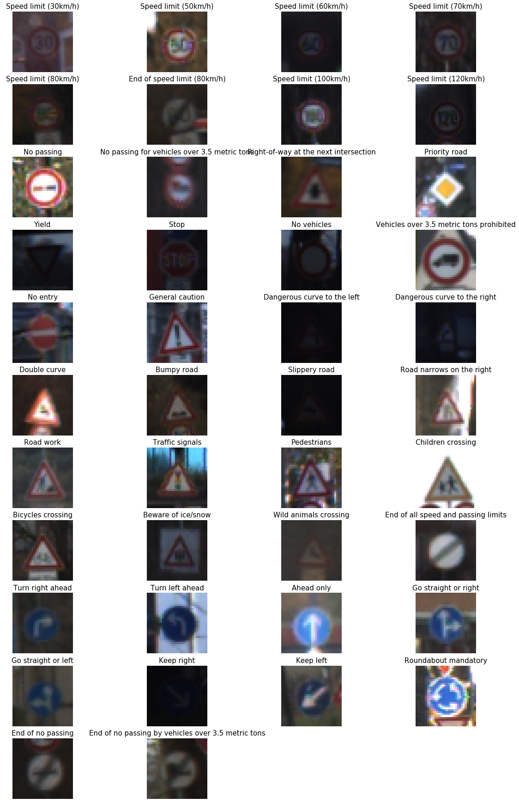

The second is historgram of number of classes. From this figure, some classes has less samples than other classes. So, I need to do data augmentation. 

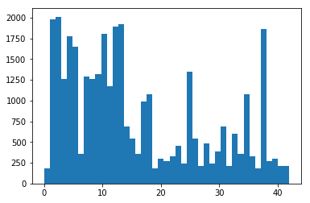

### Design and Test a Model Architecture

#### 1. Describe how you preprocessed the image data. What techniques were chosen and why did you choose these techniques? Consider including images showing the output of each preprocessing technique. Pre-processing refers to techniques such as converting to grayscale, normalization, etc. (OPTIONAL: As described in the "Stand Out Suggestions" part of the rubric, if you generated additional data for training, describe why you decided to generate additional data, how you generated the data, and provide example images of the additional data. Then describe the characteristics of the augmented training set like number of images in the set, number of images for each class, etc.)

As a first step, I decided to convert the images to grayscale because it can be applied easily and well used.

Here is an example of a traffic sign image and after grayscaling.

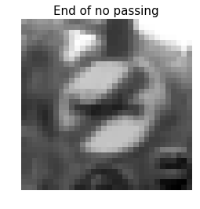

I decided to generate additional data because some classes has less number of samples than other classes.

To add more data to the the data set, I used used rotation, scaling and transform because it is introduced in the paper "http://yann.lecun.com/exdb/publis/pdf/sermanet-ijcnn-11.pdf". 

Random rotation makes rotation of [-15, 15] degrees. Following is an example of rotation. The parameter is cited from the paper. 

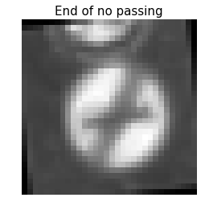

Scaling makes scaling of [0.9, 1.1]. The parameter is cited from the paper.  Following is an example scaling. 

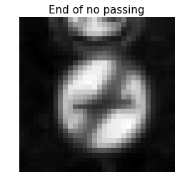

As the fourth step transform of moving [-2, 2] for both of x- and y- directions. The parameter is cited from the paper. 

Follwoings are examples of transformation. 

./images/transform.png)

Here is an example of an original image and an augmented image:

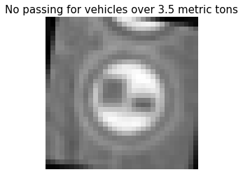

After augmentation, the number of samples in each classes are the same. 

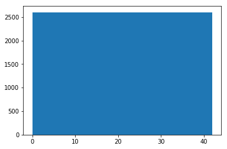

#### 2. Describe what your final model architecture looks like including model type, layers, layer sizes, connectivity, etc.) Consider including a diagram and/or table describing the final model.

I refered the model in  http://yann.lecun.com/exdb/publis/pdf/sermanet-ijcnn-11.pdf .
My final model consisted of the following layers:

| Layer         		|     Description	        					| 
|:---------------------:|:---------------------------------------------:| 
| Input         		| 32x32x1 Gray Scale image			| 
| Convolution 5x5     	| 1x1 stride, valid padding, outputs 28x28x6 	|
| RELU					|												|
| Max pooling	      	| 2x2 stride,  outputs 14x14x6 				|
| Convolution 5x5	    | 1x1 stride, valid padding, outputs 10x10x16  |
| RELU		            |         									|
| Max pooling			| 2x2 stride, outputs 5x5x16|
|Convolution 5x5		| 1x1 stride, valid padding, outputs 1x1x400	|
|RELU					|												|
| Flatten               | Flatten the second result of convolution|
| Flatten               | Flatten the third result of convolution|
|concat                 |concatenate flatten results. outputs, 800|
|dropout                | |
| Fully Conntected      | outputs 43|

#### 3. Describe how you trained your model. The discussion can include the type of optimizer, the batch size, number of epochs and any hyperparameters such as learning rate.

To train the model, I set the number of epochs as 30 and batch_size as 100.

I used learning rate 0.0001. 

I used AdamOptimizer which used LeNet in the lecture. 

#### 4. Describe the approach taken for finding a solution and getting the validation set accuracy to be at least 0.93. Include in the discussion the results on the training, validation and test sets and where in the code these were calculated. Your approach may have been an iterative process, in which case, outline the steps you took to get to the final solution and why you chose those steps. Perhaps your solution involved an already well known implementation or architecture. In this case, discuss why you think the architecture is suitable for the current problem.

My final model results were:
* validation set accuracy of 0.954 
* test set accuracy of 0.935

* What architecture was chosen?

I usec ConvNet introduced in 
"http://yann.lecun.com/exdb/publis/pdf/sermanet-ijcnn-11.pdf" and add dropout. 

* Why did you believe it would be relevant to the traffic sign application?

The model introduced in the paper is used to solve the exct same problem. 

* What I tuned

I gradually increase the number of examples for data augmentation. I start from 1200, 1500, 2000, 2100, 2500. 

I also try to tune learning late with 0.0009, 0.0001, 0.0005. 0.0001 show the best solution in my model. 

* How does the final model's accuracy on the training, validation and test set provide evidence that the model is working well?


### Test a Model on New Images

#### 1. Choose five German traffic signs found on the web and provide them in the report. For each image, discuss what quality or qualities might be difficult to classify.

Here are five German traffic signs that I found on the web:


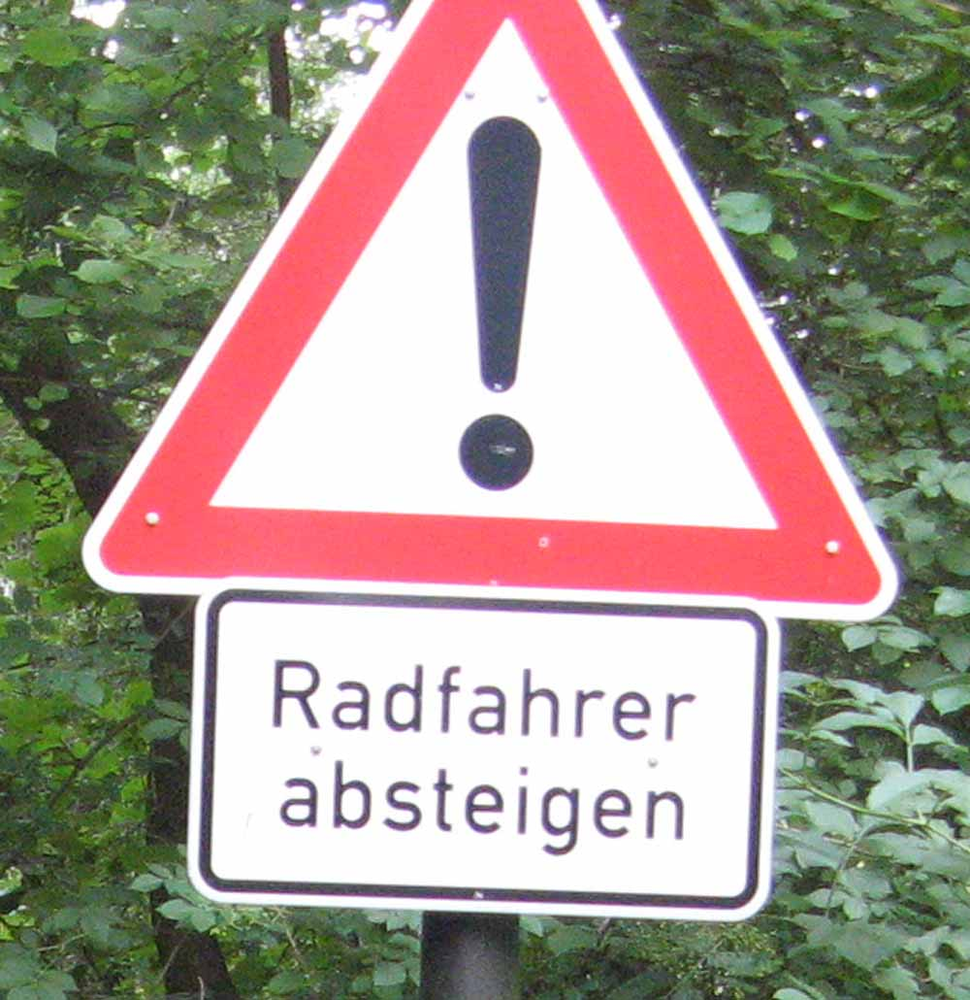
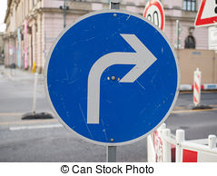
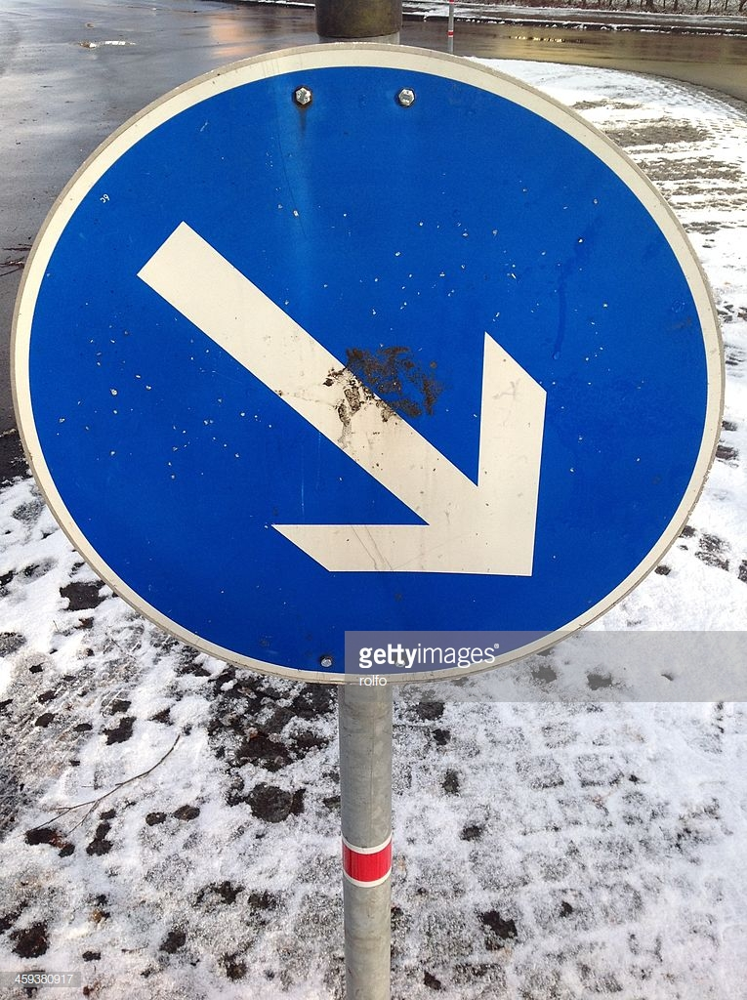
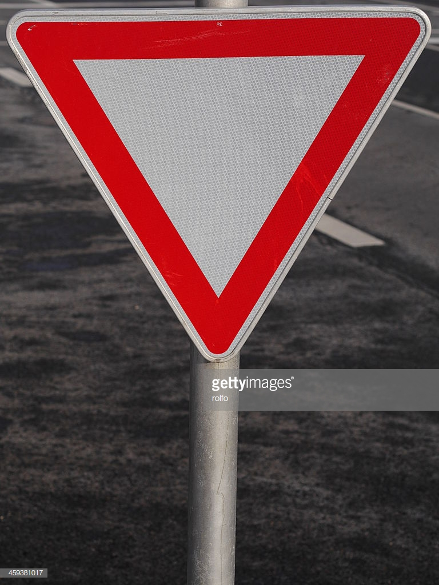


#### 2. Discuss the model's predictions on these new traffic signs and compare the results to predicting on the test set. At a minimum, discuss what the predictions were, the accuracy on these new predictions, and compare the accuracy to the accuracy on the test set (OPTIONAL: Discuss the results in more detail as described in the "Stand Out Suggestions" part of the rubric).

Here are the results of the prediction:

| Image			        |     Prediction	        					| 
|:---------------------:|:---------------------------------------------:| 
| Stop     		|  No entry 									| 
|  General caution     			| Slippery road					|
|Turn right ahead		| Turn right ahead							|
| Keep right	      		| Keep right					 				|
| Yield		| Go straight or right    							|


The model was able to correctly guess 2 of the 5 traffic signs, which gives an accuracy of 40%. The accuracy is less than the accuracy of test set. 


#### 3. Describe how certain the model is when predicting on each of the five new images by looking at the softmax probabilities for each prediction. Provide the top 5 softmax probabilities for each image along with the sign type of each probability. (OPTIONAL: as described in the "Stand Out Suggestions" part of the rubric, visualizations can also be provided such as bar charts)

The code for making predictions on my final model is located in the 11th cell of the Ipython notebook.

For the first image, the result of probability is 1.0 for the No Entry. It may cause overfitting.  The top five soft max probabilities were

```
Answer Stop
Probability 1.0, class No entry
Probability 1.0251115060977423e-11, class Stop
Probability 9.057280966895398e-12, class No passing
Probability 8.111854964869616e-15, class Turn left ahead
Probability 4.159551799136005e-15, class Turn right ahead
```

For the second image, the result of probability is 98.6% for the No Entry. It may cause overfitting.  The top five soft max probabilities were

```
Answer General caution
Probability 0.9862374067306519, class Slippery road
Probability 0.011670737527310848, class No passing
Probability 0.0019202609546482563, class Dangerous curve to the left
Probability 0.00012136712757637724, class Roundabout mandatory
Probability 4.8814650654094294e-05, class No entry
```

For the third image the result of probability is 99.9% for Turn right ahead.  The top five soft max probabilities were

```
Answer Turn right ahead
Probability 0.9999991655349731, class Turn right ahead
Probability 7.742759180473513e-07, class Keep left
Probability 8.124651174057362e-08, class Ahead only
Probability 8.486025250553642e-12, class Speed limit (60km/h)
Probability 2.048263034876152e-12, class Speed limit (70km/h)
````

For the fourth image the result of probability is 99.9% for Turn right ahead.  The top five soft max probabilities were

```
Answer Keep right
Probability 0.9999611377716064, class Keep right
Probability 3.53412251570262e-05, class No passing for vehicles over 3.5 metric tons
Probability 2.658373887243215e-06, class Go straight or right
Probability 8.635218478048046e-07, class Slippery road
Probability 5.037788142203681e-08, class No entry
```

For the fourth image the result of probability is 96% for Go Straight or right and 0.1 % for Yield. The top five soft max probabilities were

```
Answer Yield
Probability 0.9608592987060547, class Go straight or right
Probability 0.01594664715230465, class Yield
Probability 0.009252674877643585, class Right-of-way at the next intersection
Probability 0.008416863158345222, class Beware of ice/snow
Probability 0.0021000998094677925, class Dangerous curve to the right
```

### (Optional) Visualizing the Neural Network (See Step 4 of the Ipython notebook for more details)
#### 1. Discuss the visual output of your trained network's feature maps. What characteristics did the neural network use to make classifications?


